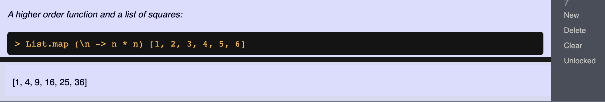
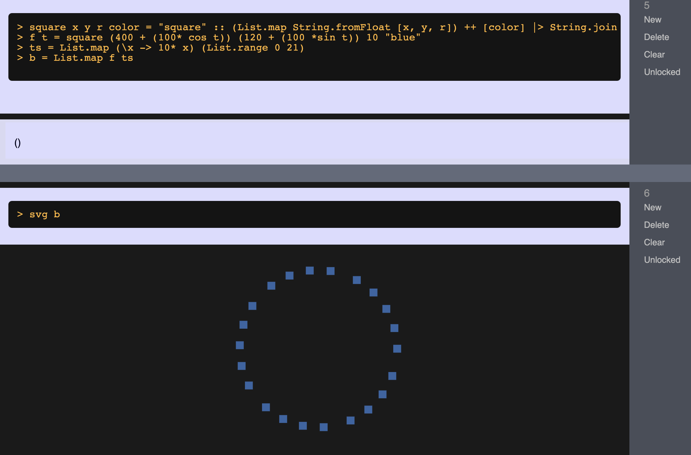
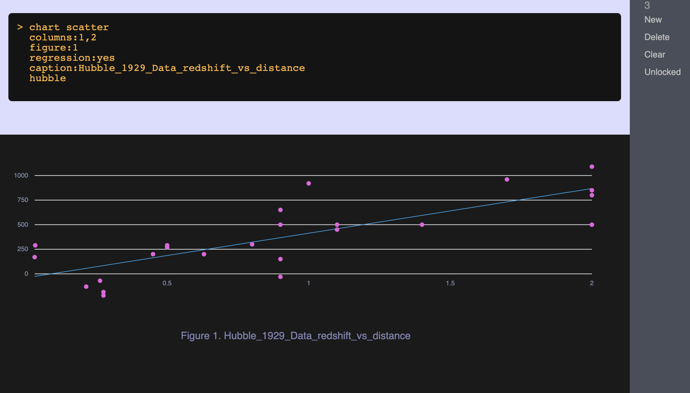

# Announcing Elm Notebook

The aim of [Elm Notebook](https://elm-notebook.lamdera.app) is to provide something akin to  Jupyter Notebooks, but for Elm: an app with cells in which you can put both text and code, and where code in a cell can be executed, producing output of various kinds — text, image, chart, animation, etc. I've thought of it mostly as a teaching
tool, but such an app could also be good for code demonstrations, experimentation,
 just playing around, etc.

I'd like Elm Notebook to be something fun, useful, and as versatile as we can make it.  The project is, 
of course, open source: [github.com/jxxcarlson/elm-notebook](https://github.com/jxxcarlson/elm-notebook). 


## A Work-In-Progress

Elm Notebook is very much a work-in-progress and I'd like to keep this experimental status in mind for a good while so that the project can adopt good ideas without
undue friction.  

Elm Notebook is based on [elm-interpreter](https://github.com/miniBill/elm-interpreter) by @minibill (Leonardo Taglialegne).

## About the app

You edit a cell by clicking on it, and you execute the code in it with control-RETURN, at which point the code is passed to elm-interpreter, with the result of the computation displayed below the cell:



### Svg

Certain cells are evaluated in a special way. For example, a cell may render svg that is defined in a prior cell:



### Data and charts

A cell may render a chart based on CSV data loaded into the
app:



*This is a chart of the recession velocity of galaxies
versus their distance from the earth.  The data
is from Edwin Hubble's 1929 paper, 
"A Relation Between Distance and Radial Velocity Among Extra-Galactic Nebulae."
This is the paper that launched the field of observational cosmology
and gave the first experimental evidence for the expansion of the universe.*

### Simulations and Animations

A cell may render an
[animation](https://www.youtube.com/watch?v=XWM-mEgJA9s):
The red dot moves in an ellipse around the 
yellow dot at the center of the ellipse.
This is *not* a simulation of planetary motion:
for that the motion has to obey Kepler's laws.
More work to do!

In this case the relevant code comes in two cells. 
The first defines a function `k `:

```elm
> k t = circle (400 + (370 * cos t)) (200 + (170 * sin t)) 10 "red"
```

The second renders the animation:

```elm
> evalSvg [k (ticks / 30), circle 400 200 20 "yellow"]
```

Here `ticks` is part of the runtime that gives access
to a discrete series of clock ticks.

### Random numbers

In addition to access to a clock, the runtime provides
access to a vector of random numbers in the range [0,1]:
on each tick of the clock.  This is illustrated by 
the next animation, a simulation of [gambler's ruin](https://youtu.be/JE0Fz9YGh8Q).

## About notebooks

Notebooks can be public or private.  
